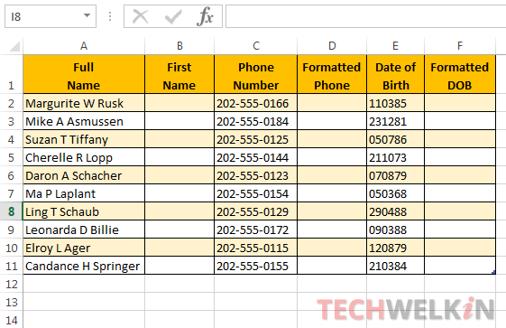
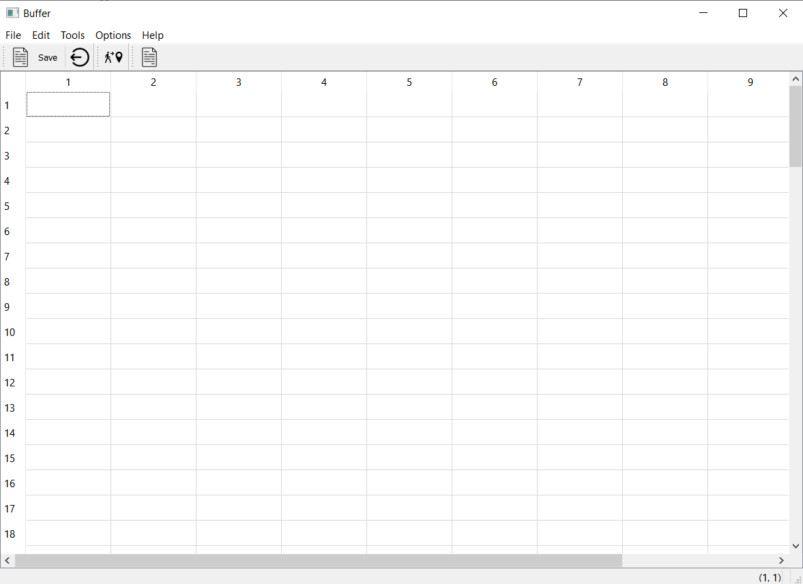

<div id="top"></div>


<!-- PROJECT LOGO -->
<br />
<div align="center">
    
  
</div>


<!-- TABLE OF CONTENTS -->
<details>
  <summary>Table of Contents</summary>
  <ol>
        <li><a href="#Introduction">introduction</a></li>
        <li><a href="#Features & Functionality">Features & Functionality</a></li>
        <li><a href="#SpreedSheet Header">SpreedSheet Header</a></li>
        <li><a href="#SpreedSheet cpp">SpreedSheet cpp</a></li>
  </ol>
</details>

- # [Introduction](#introduction)
Spreadsheets are computer applications used to store, analyze, organize, and manipulate data in the rows and columns of a grid. The program works by inserting data, which can be numbers or text, into the cells of tables. most people think of spreadsheets, they think of data entry and simple calculations. But a modern spreadsheet is more than a financial tool. These apps are a robust way to help collect, organize and analyze important data across different areas of life ,& people use it because they are easy-to-read space.
<p align="center">
     
   </p>

- # [Features & Functionality](#features-and-functionality)
##  **In our SpreadSheet we obtain an application with:**

 -Menu Bar.
 
 -Two tools bars.
 
 -Status bar to print the informations.
 
 
## **the application looks like that :**
<p align="center">
     
   </p>

  - ## [SpreedSheet Header](#spreedsheet-header)
    - ### [The header](#The-header)
    - ### [Protected Functions](#protected-functions)
    - ### [Private Slots](#private-slots)
    - ### [Pointers](#pointers)


# SpreedSheet Header:
## The header
```c++
#ifndef SPREADSHEET_H
#define SPREADSHEET_H

#include <QMainWindow>
#include <QTableWidget>
#include <QAction>
#include <QMenu>
#include <QToolBar>
#include <QLabel>
#include <QStatusBar>
#include "gocell.h"
#include "finddialog.h"
#include<QFileDialog>
#include<QTextStream>

class SpreadSheet : public QMainWindow
{
    Q_OBJECT

public:
    SpreadSheet(QWidget *parent = nullptr);
    ~SpreadSheet();
```
## Protected Functions:
```c++
protected:
    void setupMainWidget();
    void createActions();
    void createMenus();
    void createToolBars();
    void makeConnexions();
```
## Private Slots:
```c++
private slots:
    void close();
    void updateStatusBar(int, int); //Respond for the call changed
    void goCellSlot();
    void findSlot();
    void deleteslot();
    void saveSlot();//slot pour repondre a l appel save
    void loadslot();//slot pour repondre a l appel load
```
## Pointers:
```c++
//Pointers
    void saveContent(QString filename);//methode pour sauvegarder le contenu
    void loadContent(QString filename);

private:

    // --------------- Central Widget -------------//
    QTableWidget *spreadsheet;
    // --------------- Actions       --------------//
    QAction * newFile;
    QAction * open;
    QAction * save;
    QAction * saveAs;
    QAction * exit;
    QAction *cut;
    QAction *copy;
    QAction *paste;
    QAction *deleteAction;
    QAction *find;
    QAction *row;
    QAction *Column;
    QAction *all;
    QAction *goCell;
    QAction*findDialog;
    QAction *recalculate;
    QAction *sort;
    QAction *showGrid;
    QAction *auto_recalculate;
    QAction *about;
    QAction *aboutQt;


    // ---------- Menus ----------
    QMenu *FileMenu;
    QMenu *editMenu;
    QMenu *toolsMenu;
    QMenu *optionsMenu;
    QMenu *helpMenu;


    //  ----- - Widget pouyr la bare d'etat
    QLabel *cellLocation;  //position de la cellule active
    QLabel *cellFormula;   // Formuel de la cellue active
    //-------- Nom de fichier courant
    QString * currentFile;

};

#endif // SPREADSHEET_H
```

- ## [SpreedSheet Cpp](#spreedsheet-cpp)

we start by declaring the seting spreadsheat "setupMainWidget()", also we create Actions  by  "createActions()", after we create the tool bar by "createToolBars()" and we make connexions by  "makeConnexions()" , we create the labels for the status bar , besides , we initiate the name of the current file  , in the end we should give the name of the spreadsheet by "setWindowTitle".
 
  ```c++ 
//Seting the spreadsheet
setupMainWidget();

// Creaeting Actions
  createActions();

// Creating Menus
createMenus();


//Creating the tool bar
createToolBars();

//making the connexions
makeConnexions();

//Creating the labels for the status bar (should be in its proper function)
cellLocation = new QLabel("(1, 1)");
cellFormula = new QLabel("");
statusBar()->addPermanentWidget(cellLocation);
statusBar()->addPermanentWidget(cellFormula);

//initier le nom du fichier courant
currentFile = nullptr;
//mettre le nom de spreedsheet
setWindowTitle("Buffer");

```
 ### Functions:
Now, it's necessary to implement the functions mentioned before:

   #### The first "setupMainWidget()":
```c++
void SpreadSheet::setupMainWidget()
{
    spreadsheet = new QTableWidget;
    spreadsheet->setRowCount(100);
    spreadsheet->setColumnCount(10);
    setCentralWidget(spreadsheet);

}
```
   #### the second "createActions()":
   where we create the action for each one using 
   `nameAction = new QAction(ActionIcone, "&Action", this)` , if we want add icons for our actions we use
`QPixmap ActionIcone(":/new_file.png")` , also we can add shortCut by
`ActionIcone->setShortcut(tr("Ctrl+alphabet"))`:
   
```c++
void SpreadSheet::createActions()
{
    // --------- New File -------------------
   QPixmap newIcon(":/new_file.png");
   newFile = new QAction(newIcon, "&New", this);
   newFile->setShortcut(tr("Ctrl+N"));


    // --------- open file -------------------
   open = new QAction("&Open", this);
   open->setShortcut(tr("Ctrl+O"));

    // --------- open file -------------------
   save = new QAction("&Save", this);
   save->setShortcut(tr("Ctrl+S"));

    // --------- open file -------------------
   saveAs = new QAction("save &As", this);


    // --------- open file -------------------
   QPixmap cutIcon(":/cut_icon.png");
   cut = new QAction(newIcon, "Cu&t", this);
   cut->setShortcut(tr("Ctrl+X"));

   // --------- Cut menu -----------------
   copy = new QAction( "&Copy", this);
   copy->setShortcut(tr("Ctrl+C"));


   paste = new QAction( "&Paste", this);
   paste->setShortcut(tr("Ctrl+V"));


   deleteAction = new QAction( "&Delete", this);
   deleteAction->setShortcut(tr("Del"));


   row  = new QAction("&Row", this);
   Column = new QAction("&Column", this);
   all = new QAction("&All", this);
   all->setShortcut(tr("Ctrl+A"));


   QPixmap findIcon(":/search_icon.png"); find= new QAction(newIcon, "&Find", this);
   find->setShortcut(tr("Ctrl+F"));

   QPixmap goCellIcon(":/go_to_icon.png");
   goCell = new QAction( goCellIcon, "&Go to Cell", this);
   deleteAction->setShortcut(tr("f5"));


   recalculate = new QAction("&Recalculate",this);
   recalculate->setShortcut(tr("F9"));


   sort = new QAction("&Sort");


   showGrid = new QAction("&Show Grid");
   showGrid->setCheckable(true);
   showGrid->setChecked(spreadsheet->showGrid());

   auto_recalculate = new QAction("&Auto-recalculate");
   auto_recalculate->setCheckable(true);
   auto_recalculate->setChecked(true);


   about =  new QAction("&About");
   aboutQt = new QAction("About &Qt");

    // --------- exit -------------------
   QPixmap exitIcon(":/quit_icon.png");
   exit = new QAction(exitIcon,"E&xit", this);
   exit->setShortcut(tr("Ctrl+Q"));
}
```
  #### The fourth is "createMenus()":
here we add Menus ,we have 5 Name menus "File", "Edit" ,"Toosl", "Optins", "Help"  by 
`NameMenu = menuBar()->addMenu("&Name")`
and we add actions by using 
`NameMenu->addAction(action)`:

```c++
void SpreadSheet::createMenus()
{
    // --------  File menu -------//
    FileMenu = menuBar()->addMenu("&File");
    FileMenu->addAction(newFile);
    FileMenu->addAction(open);
    FileMenu->addAction(save);
    FileMenu->addAction(saveAs);
    FileMenu->addSeparator();
    FileMenu->addAction(exit);


    //------------- Edit menu --------/
    editMenu = menuBar()->addMenu("&Edit");
    editMenu->addAction(cut);
    editMenu->addAction(copy);
    editMenu->addAction(paste);
    editMenu->addAction(deleteAction);
    editMenu->addSeparator();
    auto select = editMenu->addMenu("&Select");
    select->addAction(row);
    select->addAction(Column);
    select->addAction(all);

    editMenu->addAction(find);
    editMenu->addAction(goCell);


    //-------------- Toosl menu ------------
    toolsMenu = menuBar()->addMenu("&Tools");
    toolsMenu->addAction(recalculate);
    toolsMenu->addAction(sort);


    //--------------Optins menus-------------
    optionsMenu = menuBar()->addMenu("&Options");
    optionsMenu->addAction(showGrid);
    optionsMenu->addAction(auto_recalculate);


    //----------- Help menu ------------
    helpMenu = menuBar()->addMenu("&Help");
    helpMenu->addAction(about);
    helpMenu->addAction(aboutQt);
}
```
  #### The fifth one is "createToolBars()":
where we create the toolbars by 
`auto toolbarName = addToolBar("Name");` and we add for each one the actions by using
`toolbarName->addAction(qction);`

```c++
void SpreadSheet::createToolBars()
{

    //Creer une bare d'outils
    auto toolbar1 = addToolBar("File");


    //Ajouter des actions acette bar
    toolbar1->addAction(newFile);
    toolbar1->addAction(save);
    toolbar1->addSeparator();
    toolbar1->addAction(exit);
    


    //Creer une autre tool bar
    auto toolbar2  = addToolBar("ToolS");
    toolbar2->addAction(goCell);
    auto toolbar3  = addToolBar("ToolS");
    toolbar3->addAction(find);
}
```
   #### the sixth one is "updateStatusBar()":
```c++
void SpreadSheet::updateStatusBar(int row, int col)
{
    QString cell{"(%0, %1)"};
   cellLocation->setText(cell.arg(row+1).arg(col+1));

}
```
In the end if the functions mentionned before we find the important one :
  #### the "makeConnexion()":
 here we make connexion of the chane of any element in the spreadsheet with the update status barby using
 `connect(action,&QAction::triggered,name,&QTableWidger::actionSlot)`
 
 ```c++
 void SpreadSheet::makeConnexions()
{

   // --------- Connexion for the  select all action ----/
   connect(all, &QAction::triggered,
           spreadsheet, &QTableWidget::selectAll);

   // Connection for the  show grid
   connect(showGrid, &QAction::triggered,
           spreadsheet, &QTableWidget::setShowGrid);

   //Connection for the exit button
   connect(exit, &QAction::triggered, this, &SpreadSheet::close);


   //connectting the chane of any element in the spreadsheet with the update status bar
   connect(spreadsheet, &QTableWidget::cellClicked, this,  &SpreadSheet::updateStatusBar);

   connect(goCell, &QAction::triggered, this, &SpreadSheet::goCellSlot);

   connect(find, &QAction::triggered, this, &SpreadSheet::findSlot);

   connect (open,&QAction::triggered, this, &SpreadSheet::loadslot);
   //connection de save slot
   connect(save, &QAction::triggered,this,&SpreadSheet::saveSlot);
   //conncet del_slot
   connect(deleteAction, &QAction::triggered, this, &SpreadSheet::deleteslot);
}
 ```


Our Team -[DARBAL nour-elhouda](https://github.com/teamkhaoulanour) -[MZOUDI Khaoula](https://github.com/KhaoulaMzoudi)

Project Link: [SpreadSheet](https://github.com/Darbal-Nour-elhouda/Spreadsheet)

Encadré par : [Mr.Belcaid Anass](https://)

<p align="right">(<a href="#top">back to top</a>)</p>
